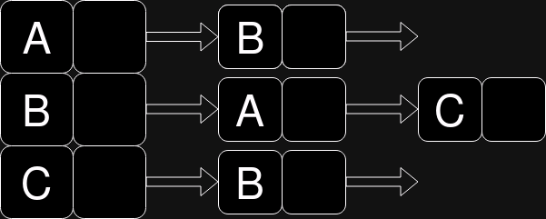

# Tutorial - Bibgrafo
## Teoria dos Grafos - IFPB Campina Grande

Neste tutorial, você aprenderá a utilizar a biblioteca Bibgrafo, utilizada como ferramenta de ensino na disciplina de Teoria dos Grafos. Este tutorial utiliza como referência a release `2.0` da biblioteca, lançada em `[adicionar mês]` de 2024.

Este tutorial é direcionado especialmente aos estudantes da disciplina de Teoria dos Grafos do curso de Engenharia da Computação, no IFPB Campina Grande.

Vamos começar entendendo um pouco da estrutura na qual se baseia a biblioteca.

## Um pouco sobre Orientação a Objetos em Python

A biblioteca Bibgrafo (de agora em diante, apenas Bibgrafo) é uma implementação Python de conceitos básicos de Teoria dos Grafos, baseada no paradigma de orientação a objetos. Se você ainda não conhece este paradigma ou não o conhece na linguagem Python, esta seção irá lhe ajudar bastante. Caso contrário, esteja livre para prosseguir com o resto do tutorial.

Orientação a objetos é um paradigma de programação onde é possível definir novos tipos abstratos de dados que combinam membros de dados e funções que trabalham sobre estes mesmos dados. Estes tipos são denominados **classes**. Talvez você já esteja familiarizado com os *structs* da linguagem C. Classes e *structs* são ambos tipos abstratos, porém as classes possuem capacidades que os *structs* não tem.

Vamos utilizar o exemplo de uma carta de baralho, na linguagem C, e vamos criar um objeto deste tipo:

```c
typedef struct Carta {
    char* naipe;
    char* valor;
} Carta;

int main() {
    Carta carta; // Rainha de Copas
    carta.naipe = "Copas";
    carta.valor = "Rainha";
}
```

Como você pode ver, o *struct* precisa ser criado para depois inicializarmos os seus valores. E se pudéssemos fazer isso numa operação só? Vamos definir uma classe carta em Python:

```python
class Carta:
    def __init__(self, naipe, valor):
        self.naipe = naipe
        self.valor = valor

carta1 = Carta("Copas", "Rainha")
```

Interessante, não? Talvez tudo que você esteja se perguntando é: por que `__init__`, o que é `self` e como esse "objeto" é criado? Vamos responder uma pergunta por vez. Primeiro, `__init__` é um método "mágico" (como define o próprio Python) que sobrecarrega a operação de inicialização de um objeto (a criação da variável `carta1` é uma inicialização, e os argumentos `"Copas"` e `"Rainha"` são passados para a mesma função `__init__`). A este tipo de função, é dado o nome de **construtor**. Todos os objetos tem um construtor, e ele pode receber um ou mais argumentos.

Mas e o `self`? Então, o `self` (do inglês, "si mesmo"), que em algumas linguagens como o C++ e Java é também chamado de `this`("este"), é uma variável que aponta, como diz o nome, para si mesma. Como assim para si mesma? O que criamos na variável `carta1` foi uma **instância** do tipo Carta, isto é, uma carta, enquanto a classe define apenas o tipo abstrato. O ponteiro `self` aponta para a instância que está fazendo a chamada da função membro da classe.

Vamos ver um outro exemplo, que já é mais familiar para quem tem alguma mínima prática com Python. Vamos definir uma lista:

```Python
class Lista: # pense que aqui está a mesma lista padrão do Python
    def __init__(self):
        # não importa

    def adicionar(self, item):
        # adiciona ao fim, como a operação `append` do tipo lista de Python

variavel_lista = Lista()
variavel_lista.adicionar(1) # adiciona o número 1 à lista
```

A operação descrita na última linha também poderia ser escrita, numa sintaxe válida do Python, como:

```python
Lista.adicionar(variavel_lista, 1) # self, item
```

Percebe agora que o `self` recebe a instância, isto é, o objeto que chamou a função? Todas as funções que são membros de uma classe utilizam este ponteiro. Uma observação para quem já estudou orientação a objetos em outras linguagens, onde o ponteiro `this` é na maior parte das vezes opcional: **no Python, `self` é obrigatório para indicar variáveis e funções que pertencem à classe**.

Basicamente, tudo que vimos em funções do Python pode ser aplicado em orientação a objetos. Você poderá explorar melhor o paradigma à medida que vai explorar a biblioteca. Não se preocupe em aprender tudo agora, você poderá voltar e usar este tutorial de referência ao longo do seu curso.

## Instalando a biblioteca

Para a instalação da biblioteca, vamos utilizar o módulo `pip`, que é o gerenciador de pacotes do Python. Para utilizá-lo, você poderá utilizar um `venv` ou ambiente virtual (se está usando a IDE PyCharm, ele já cria um `venv` para você a cada novo projeto criado).

Caso você não utilize um `venv`, lembre se de utilizar sempre `python3 -m pip` ao invés de simplesmente `pip`, para chamar o `pip` como módulo executável da sua linha de comando.

Você deverá utilizar o comando `pip install bibgrafo` para instalar a biblioteca. Você pode testá-la colocando em um arquivo:

```python
import bibgrafo
```

## Os tipos Vértice e Aresta

As primeiras classes que temos são os tipos `Vertice`, `Aresta` e `ArestaDirecionada`. Elas representam um vértice e uma aresta, respectivamente.

O construtor de Vértice recebe seu rótulo como atributo. Para criar seu primeiro vértice, você poderá utilizá-lo:

```python
from bibgrafo.vertice import Vertice

vertice = Vertice("1") # rótulo
print(vertice) # Saída: 1 (o rótulo do vértice)
```

Você pode também:

```python
v1 = Vertice("1")
v2 = Vertice("2")

# nesta operação, serão comparados apenas os rótulos dos vértices
# quais serão as saídas, na sua opinião?
print(v1 == v2)
print(v1 != v2)
```

Já os tipos `Aresta` e `ArestaDirecionada` representam, respectivamente, uma aresta não direcionada e direcionada. O construtor de ambas recebe como argumentos um rótulo (*string*), e dois objetos do tipo Vertice - `v1` e `v2`. Você também pode informar um número inteiro como peso, mas caso não faça, o peso padrão da aresta será sempre 1.

Qual a diferença entre `Aresta` e `ArestaDirecionada`? Crie duas arestas, uma aresta não direcionada e uma direcionada, e tente imprimi-las, como no exemplo a seguir:

```python
from bibgrafo.vertice import Vertice
from bibgrafo.aresta import Aresta, ArestaDirecionada
v1 = Vertice("1")
v2 = Vertice("2")
aresta = Aresta("a1", v1, v2)
aresta_dir = ArestaDirecionada("a2", v1, v2, 2) # peso é opcional

print(aresta)
print(aresta_dir) # Qual a saída desses prints?
```

Você verá que a saída de `aresta_dir` é `a1(1->2), 2`, contendo o rótulo, as pontas e o peso ao final, enquanto que a primeira aresta, não direcionada, não possui esse símbolo de seta. Uma outra diferença é que você precisará usar o tipo `ArestaDirecionada` para grafos direcionados. Você pode inclusive:

Você pode utilizar os operadores `==` e `!=` também para as arestas. O operador de (des)igualdade irá comparar os vértices das arestas entre si, com a diferença que para as arestas direcionadas, o `v1` da primeira deve ser igual ao `v1` da segunda e o mesmo para o `v2`, já que presumimos uma relação saída-entrada na aresta direcionada. Também é possível usar os comparadores `>`, `>=`, `<`, `<=` para as arestas, comparando apenas os seus pesos, o que será útil para ordenar listas de arestas.

```python
from bibgrafo.vertice import Vertice
from bibgrafo.aresta import Aresta, ArestaDirecionada

v1 = Vertice("1")
v2 = Vertice("2")

a1 = Aresta("a1", v1, v2, 2)
a2 = Aresta("a2", v2, v1, 3)

a3 = ArestaDirecionada("a3", v1, v2)
a4 = ArestaDirecionada("a4", v2, v1)

print(a1 == a2) # True
print(a3 == a4) # False
print(a2 > a1) # True
```

Uma operação avançada com vértices é que é possível passarmos atributos para eles através de um dicionário `attr`, embutido no construtor. Digamos que desejemos que nosso vértice represente uma cor. Podemos criá-lo com esta característica da seguinte maneira:

```python
from bibgrafo.vertice import Vertice
v1 = Vertice("1", attr={"cor": "vermelho"})
v2 = Vertice("2") # parâmetro opcional, o valor padrão de `attr` é `None`
```

## Definição de grafo

Um grafo $ G $ é um dupla $ (N, A) $, onde $ N $ representa o conjunto de vértices e $ A $, o conjunto de arestas. Um grafo direcionado $ G' $ é também uma dupla $ (N, A) $ onde se pode definir uma ordem nos pares de vértices de cada aresta.

Muitas aplicações computacionais necessitam considerar um conjunto de conexões entre pares de objetos. Alguns exemplos são:

- determinação de rotas de mensagem e\ou tráfego em geral
- modelagem de circuitos digitais
- representação de processos em um sistema distribuído
- conexões em comum em uma rede social
- *matches* em processos seletivos
- árvores de decisão e redes neurais, utilizadas em Inteligência Artificial

A partir destes relacionamentos e suas características, podemos responder perguntas como: qual o caminho mais curto de um ponto até outro? Ou como percorrer todos os pontos da maneira mais eficiente possível? Grafos também são uma estrutura de dados similares às árvores, e algoritmos para manipulá-los são de enorme importância na ciência da computação.

Para representar grafos, é necessário utilizar alguma estrutura de dados mais elementar (como listas ou matrizes). Ou, no caso da biblioteca Bibgrafo, um conjunto para os seus vértices e um conjunto para suas arestas. Trabalharemos com duas representações mais usuais: as listas de adjacência e as matrizes de adjacência. Elas serão implementadas como classes na Bibgrafo, ambas com variantes direcionadas e não direcionadas. Todas elas terão como base a classe abstrata `GrafoIF`.

## O tipo GrafoIF

Temos um classe abstrata de base (ou ABC) na Bibgrafo: a classe `GrafoIF` ("IF" de interface, não de Instituto Federal). Esta classe define apenas quais funções serão implementadas pelas classes de grafos que veremos a seguir. Mas pode ser que em alguns módulos desta biblioteca, você veja o nome `GrafoIF` em algum erro. Isso significa que alguma função esperava uma instância de algum dos grafos posteriores (que são derivados de `GrafoIF`), e você provavelmente passou um argumento inválido.

## Listas de Adjacência

O primeiro tipo de grafo que vamos estudar nesta biblioteca são as **listas de adjacência**. Elas são recomendadas para grafos esparsos, isto é, onde $ |A| < |V|^2 $. A lista de adjacência é uma implementação mais compacta, sendo utilizada na maioria das aplicações. Entretanto, ela possui como desvantagem principal o fato de que a operação para determinar se existe uma aresta entre dois vértices possui tempo $ O(n) $.

Na sua implementação mais simples, ela utiliza um vetor com $ n $ listas ligadas - que podemos também implementar como um dicionário (já que as estruturas de dados são equivalentes), onde cada vértice é uma chave, e uma lista de vértices adjacentes é o seu valor. Vamos pensar um grafo não direcionado $ G(N,A) $, onde $ N = \{A, B, C\} $ e $ A = \{(A,B);(B,A);(B,C)\} $. A nossa lista de adjacência seria o dicionário a seguir:

```python
lista_adj = {
    "A": ["B"],
    "B": ["A", "C"],
    "C": ["B"]
}
```

Ou de uma maneira visual, usando a representação do vetor de listas ligadas:



No caso da biblioteca Bibgrafo, a lista de adjacência é uma classe que possui uma `list` de vértices chamada `vertices` e um `dict` de objetos `Aresta` (ou `ArestaDirecionada` para o caso da lista de adjacência direcionada). Neste dicionário, os rótulos de cada `Aresta` são as chaves, e a própria `Aresta` é o valor. Mesmo assim, a operação para determinar se existe uma aresta entre dois vértices ainda possui tempo de execução $ O(n) $, pois no pior dos casos, será necessário percorrer todas as arestas do grafo.

Você pode importar as listas de adjacência e inicializá-las da seguinte maneira.

```python
from bibgrafo.grafo_lista_adj_dir import GrafoListaAdjacenciaDirecionado
from bibgrafo.grafo_lista_adj_nao_dir import GrafoListaAdjacenciaNaoDirecionado

lista = GrafoListaAdjacenciaDirecionado()
lista_naodir = GrafoListaAdjacenciaNaoDirecionado()
```

Vamos ver algumas possíveis operações com a lista de adjacência. Utilizaremos a variável `lista` de agora em diante, ou seja, a lista de adjacência direcionada, mas todas as operações serão válidas a menos que especificado.

Para adicionar um vértice ao grafo:

```python
from bibgrafo.vertice import Vertice
lista.adiciona_vertice("A") # string
vertice = Vertice("B")
lista.adiciona_vertice(vertice) # objeto Vertice
lista.adiciona_vertice("B") # VerticeInvalidoError: o rótulo de vértice B já existe no grafo
```

Para saber se um vértice é válido, você pode chamar as funções:

```python
print(lista.existe_rotulo_vertice("A")) # True
print(lista.existe_vertice(Vertice("C"))) # False
```

Ou também, para ser se um vértice é valido:

```python
print(lista.vertice_valido(Vertice("A"))) # True, pois se trata de um objeto Vertice e um vértice de rótulo "A" está presente no grafo
```

Para recuperar um vértice específico, você pode utilizar a seguinte função:

```python
vertice_a = lista.get_vertice("A")
vertice_c = lista.get_vertice("C") # VerticeInvalidoError: o vértice não existe no grafo
vertice_b = lista.vertices[1] # a lista `vertices` pode ser acessada diretamente
```

Para as arestas, podemos adicionar uma `Aresta` ao grafo da seguinte maneira:

```python
from bibgrafo.aresta import Aresta
vertice_a = Vertice("A")
vertice_b = Vertice("B")

# Para que a adição da aresta seja válida, você deve adicionar os seus vértices no grafo antes
lista.adiciona_vertice(vertice_a)
lista.adiciona_vertice(vertice_b)

a1 = ArestaDirecionada("a1", vertice_a, vertice_b) # peso padrão: 1

lista.adiciona_aresta(a1)
print(lista) # Veja o que acontece agora
```

No caso da lista não direcionada, você deve adicionar um objeto do tipo `Aresta`:

```python
lista_naodir.adiciona_vertice(vertice_a)
lista_naodir.adiciona_vertice(vertice_b)

a1_naodir = Aresta("a1", vertice_a, vertice_b)
lista_naodir.adiciona_aresta(a1_naodir)
```

Uma outra opção é, **após adicionar os vértices**, utilizar a função `adiciona_aresta` da seguinte maneira:
```python
lista.adiciona_aresta("a1", "A", "B", 2) # peso é opcional
# a mesma função está disponível para listas não direcionadas
```
Nesse caso, você deve passar os rótulos ao invés dos objetos `Vertice`, utilizados nos construtores de objetos do tipo `Aresta` ou `ArestaDirecionada`.

Você também pode conferir, dentro da lista, se o rótulo de uma aresta está presente nela:

```python
print(lista.existe_rotulo.aresta("a1")) # True
```
Ou também reaver um objeto aresta através de:

```python
a1 = lista.get_aresta("a1") # rótulo
# ou 
a1 = lista.arestas["a1"] # o dicionário `arestas` pode ser acessado diretamente
```

Por fim, também é possível remover um vértice ou uma aresta do grafo:

```python
lista.remove_vertice("A") # isto irá remover também todas as arestas que contém o vértice
lista.remove_vertice("C") # erro, não existe no grafo

lista.remove_aresta("a1") # remove apenas a aresta a1, mas não os seus vértices
lista.remove_aresta("b1") # erro
```

## Matrizes de Adjacência

O segundo tipo de implementação de grafos que vamos encontrar na Bibgrafo são as **matrizes de adjacência**. Ela consiste de uma matriz n x n, onde cada índice da matriz corresponde a um vértice.  Uma possibilidade de implementação mais simples é utilizar uma matriz de bits, onde 0 corresponde a um par não adjacente, e 1 corresponde a um par adjacente. A matriz de adjacência é mais indicada para grafos densos, onde $ |A| \leq |V|² $, já que a operação para determinar se existe uma aresta entre dois vértices é de tempo $ O(1) $. Contudo, ela necessita de $ \Omega (|V|²) $ para ser implementada, e para percorrê-la, é necessário uma operação de tempo $ O(|V|²) $.

Sendo uma matriz quadrática, é possível diferenciar matrizes de adjacência para grafos direcionados de não direcionados da seguinte forma: consideremos dois vértices $ A $ e $ B $ , cujos índices seriam 0 e 1, respectivamente. Ao adicionarmos uma aresta não direcionada $ (A, B) $ em uma matriz direcionada, será adicionada apenas um bit 1 na posição $ (0, 1) $. Em uma matriz não direcionada, serão adicionados bits 1 nas posições $ (0, 1) $ e $ (1, 0) $.

.png)

Na Bibgrafo, as matrizes de adjacência seguem este princípio para diferenciar grafos direcionados e não direcionados. Porém, cada posição da matriz contém um dicionário, que guarda cada aresta individualmente. Este dicionário possui as arestas como valores e seus rótulos como chaves ou índices. Sendo assim, garantimos que as arestas podem ser acessadas em tempo $ O(1) $, mas que é possível ter múltiplas arestas em uma mesma posição, todas com suas informações preservadas. Por fim, também temos a lista de vértices, onde o índice do vértice corresponde ao índice de suas arestas na matriz.

Para criar uma matriz de adjacência com a Bibgrafo, utilize o código abaixo:

```python
from bibgrafo.grafo_matriz_adj_dir import GrafoMatrizAdjacenciaDirecionado
from bibgrafo.grafo_matriz_adj_nao_dir import GrafoMatrizAdjacenciaNaoDirecionado

grafo = GrafoMatrizAdjacenciaDirecionado()
grafo_nao_dir = GrafoMatrizAdjacenciaNaoDirecionado()
```

Igualmente, podemos adicionar vértices e arestas:

```python
grafo.adiciona_vertice("A")
grafo.adiciona_vertice("B")
grafo.adiciona_vertice("C")

grafo.adiciona_aresta("a1", "A", "B")
grafo.adiciona_aresta("a2", "A", "C")
grafo.adiciona_aresta("a3", "B", "C")

print(grafo) # Veja o que acontece agora!
```

Podemos acessar diretamente a matriz de arestas através do atributo `matriz`

```python
print(grafo.matriz[0][1]) # dicionário que contém aresta a1:A->B
```

Podemos também remover vértices (removendo junto as suas arestas) ou arestas individuais:

```python
grafo.remove_vertice("C")
grafo.remove_aresta("a3") # erro: aresta já foi removida junto com vértice C
```

Igualmente, podemos acessar os vértices, agora diretamente na lista `vertices`:

```python
print(lista.vertices)
```

Temos também uma função para nos ajudar a achar o índice de um vértice

```python
print(grafo.indice_do_vertice("A")) # 0
print(grafo.indice_do_vertice("D")) # None → não estoura exceção, mas é necessário atentar-se
```

Podemos também obter um vértice pelo seu rótulo, ou descobrir se ele existe no grafo:

```python
print(grafo.get_vertice("A"))
print(grafo.existe_rotulo_vertice("D")) # False
print(grafo.existe_vertice(Vertice("D"))) # False
```

O mesmo vale para as arestas:

```python
print(grafo.existe_aresta(ArestaDirecionada("a1", Vertice("A"), Vertice("B")))) # True
print(grafo.aresta_valida(ArestaDirecionada("a4", Vertice("A"), Vertice("B")))) # True → aresta é válida, porém não existe no grafo
```

## GrafoBuilder

Na Bibgrafo, contamos também com um gerador semiautomático de grafos implementado no padrão *builder*, na classe `GrafoBuilder`. O `GrafoBuilder` pode ser utilizado para construir grafos com uma sintaxe mais limpa, ou até construir grafos com parâmetros predefindos de forma aleatória, como um grafo completo $ K_{n} $ ou um grafo que contenha um certo número de arestas paralelas ou laços. Ele é especialmente útil para realização de exercícios para algoritmos simples com a biblioteca.

O `GrafoBuilder` pode ser importado da seguinte maneira: 

```python
from bibgrafo.grafo_builder import GrafoBuilder
from bibgrafo.grafo_matriz_adj_dir import GrafoMatrizAdjacenciaDirecionado

grafo = GrafoBuilder().tipo(GrafoMatrizAdjacenciaDirecionado()).vertices(5).arestas(True).build()
print(grafo) # grafo completo K5
```

Um **builder** é um padrão de programação onde um objeto complexo é construído passo a passo, permitindo criar diferentes tipos e representações de um mesmo objeto usando o mesmo código.

Imaginemos uma classe `Pessoa`, cujos atributos seriam peso e altura. Ao invés de:

```python
p = Pessoa()
p.peso = 80
p.altura = 1.77
```

Teríamos:

```python
p = PessoaBuilder().peso(80).altura(1.77).build() # função build retorna um objeto Pessoa, ao invés do seu builder
```

Sendo assim, podemos utilizar o nosso `GrafoBuilder` da mesma maneira. Ele possui três funções principais:

- `tipo`: que recebe uma instância derivada de `GrafoIF` (matriz ou lista de adjacência)
- `vertices`: que recebe os vértices
- `arestas`: que recebe os parâmetros para criação das arestas
- por fim, temos a função `build`, que retorna o grafo

Cada função possui múltiplas opções de parâmetros. A função `tipo` pode receber qualquer instância de um grafo implementado na biblioteca, ou seja, derivada de `GrafoIF`. Como vimos no exemplo anterior:

```python
from bibgrafo.grafo_builder import GrafoBuilder
from bibgrafo.grafo_matriz_adj_dir import GrafoMatrizAdjacenciaDirecionado

grafo = GrafoBuilder().tipo(GrafoMatrizAdjacenciaDirecionado()).vertices(5).arestas(True).build()
print(grafo)
```

Já a função `vertices` pode receber dois tipos de parâmetros: um número inteiro e uma lista. Se o *builder* recebe um número $ n $, ele irá gerar $ n $ vértices nomeados `A`, `B`, `C`, ... `AB`, e assim por diante. Nesta opção, é possível passar um parâmetro `start`, que será o rótulo do primeiro vértice. Lembrando que `start ` deve ser uma *string* de caracteres maiúsculo!

```python
from bibgrafo.grafo_builder import GrafoBuilder
from bibgrafo.grafo_matriz_adj_dir import GrafoMatrizAdjacenciaDirecionado

grafo = GrafoBuilder().tipo(GrafoMatrizAdjacenciaDirecionado()).vertices(5, start='B').arestas(True).build()
print(grafo) # vértices: B, C, D, E, F
```

Se passada uma lista, esta lista pode conter objetos do tipo `Vertice` ou *strings*, contendo os rótulos dos vértices a serem adicionados, assim como na função `adiciona_vertice` que encontramos nos grafos anteriores.

```python
lista_v = ['A', 'B', 'C', 'D']
lista_v2 = [Vertice('A'), Vertice('B'), Vertice('C'), Vertice('D')]

grafo = GrafoBuilder().tipo(GrafoMatrizAdjacenciaDirecionado()).vertices(lista_v).arestas(4).build()
grafo = GrafoBuilder().tipo(GrafoMatrizAdjacenciaDirecionado()).vertices(lista_v2).build() # grafo sem arestas
```

Já a função de arestas pode receber os seguintes parâmetros:

- um número inteiro, equivalente ao número de arestas
- um valor booleano, como `True`
- uma lista de objetos do tipo `Aresta` (ou `ArestaDirecionada`, se seu grafo for direcionado)

Se passado um valor booleano, será construído um grafo completo com os vértices fornecidos. É o que vimos no primeiro exemplo, que gera um grafo $ K_{5} $. Lembrando que: **para grafos direcionados, não são gerados pares $ (u, v) $ e $ (v, u) $**. Nesta opção, também temos dois parâmetros opcionais: `peso_min` e `peso_max`. Se informados, as arestas terão um peso aleatório no intervalo $ [a,b] $ fornecido.

```python
from bibgrafo.grafo_builder import GrafoBuilder
from bibgrafo.grafo_matriz_adj_dir import GrafoMatrizAdjacenciaDirecionado

# valores padrão: peso_min = 0; peso_max = 1, caso peso_min == peso_max, todas as arestas conterão o valor de peso_max
grafo = GrafoBuilder().tipo(GrafoMatrizAdjacenciaDirecionado()).vertices(5).arestas(True, peso_min=1, peso_max=5).build()
print(grafo)
```


Se passado um número inteiro $ n $, serão geradas $ n $ arestas a partir dos vértices fornecidos. Nesta opção, temos alguns parâmetros opcionais.

- `lacos` (`int`) → serão inseridos $ n $ laços, a partir de vértices aleatórios.
- `desconexos` (`int`) → será inserido um subgrafo $ K_{n} $ completo a partir de $ n $ vértices desconexos. Valor mínimo: 0 (padrão). Valor máximo: $ V - 2 $ (sendo $ V $ o número de vértices).
- `paralelas` (`int`) → serão duplicadas `N` arestas aleatórias, como um novo peso aleatório. Valor mínimo: 0 (padrão).
- Temos também os parâmetros `peso_min` e `peso_max`, como na última assinatura desta função.

```python
grafo = GrafoBuilder().tipo(GrafoMatrizAdjacenciaDirecionado()).vertices(5).arestas(5, peso_min=1, peso_max=5, lacos=2, desconexos=1, paralelas=1).build()
print(grafo)
```

E por último, podemos fornecer uma lista de objetos `Aresta` ou `ArestaDirecionada` para o nosso *builder*. Lembrando que precisamos dos mesmos objetos `Vertice` que já estão inclusos (neste caso, precisam conter apenas o mesmo rótulo e dicionário de atributos).

```python
lista_arestas = [
    ArestaDirecionada("a1", Vertice("A"), Vertice("B")),
    ArestaDirecionada("a2", Vertice("B"), Vertice("A"))
]
grafo = GrafoBuilder().tipo(GrafoMatrizAdjacenciaDirecionado()).vertices(2).arestas(lista_arestas).build() # como a função vertices recebe o inteiro 2, os vértices adicionados serão A e B
```

### O módulo JSON

Por fim, para facilitar a padronização de testes, a Bibgrafo implementa um módulo simples para ler e salvar grafos em formato JSON. O módulo `GrafoJSON` pode ser importado da seguinte maneira:

```python
from bibgrafo.grafo_json import GrafoJSON
```

Vamos criar um grafo K5 completo e salvá-lo em formato JSON:

```python
k5 = GrafoBuilder().tipo(GrafoListaAdjacenciaDirecionado()).vertices(5).arestas(True).build()
GrafoJSON.grafo_to_json(k5, "k5.json") # lembrando que é necessário que o primeiro argumento seja uma subclasse de GrafoIF
```

Caso você deseje ler este mesmo arquivo, você pode salvá-lo em um grafo de outro tipo:

```python
k5_matriz = GrafoJSON.json_to_grafo("k5.json", GrafoMatrizAdjacenciaDirecionado()) # lembrando que é necessário que o segundo argumento seja uma subclasse de GrafoIF
```

## Referências

- A Gentle Introduction to Graph Neural Networks (Sanchez-Legenling, B.; Reif, E.; Pearce, A.; Wiltschko, A. B.)

- Builder - Refactoring Guru

- "Essentials: Brian Kernighan on Associative Arrays - Computerphile" (YouTube)

- Estruturas de Dados e Algoritmos em C - Osmar Quirino da Silva

- Projeto de Algoritmos e Estruturas de Dados com implementações em Pascal e C - Nívio Ziviani

- Treinamento em Linguagem C++ Módulo 2, Victorine Viviane Mizrahi